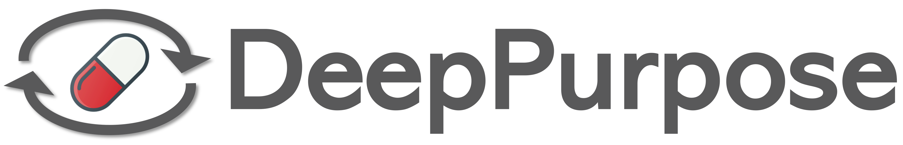

<p align="center"></p>


<h3 align="center">
<p> A Deep Learning Library for Compound and Protein Modeling <br>DTI, Drug Property, PPI, DDI, Protein Function Prediction<br></h3>
<h4 align="center">
<p> Applications in Drug Repurposing, Virtual Screening, QSAR, Side Effect Prediction and More </h4>

---

[](https://pypi.org/project/DeepPurpose/)
[](https://pepy.tech/project/deeppurpose)
[](https://pepy.tech/project/deeppurpose)
[](https://github.com/kexinhuang12345/DeepPurpose/stargazers)
[](https://github.com/kexinhuang12345/DeepPurpose/network/members)

This repository hosts DeepPurpose, a Deep Learning Based Molecular Modeling and Prediction Toolkit on Drug-Target Interaction Prediction, Compound Property Prediction, Protein-Protein Interaction Prediction, and Protein Function prediction (using PyTorch). We focus on DTI and its applications in Drug Repurposing and Virtual Screening, but support various other molecular encoding tasks. It allows very easy usage (several lines of codes only) to facilitate deep learning for life science research. 

### News!
- [05/21] `0.1.2` Support 5 new graph neural network based models for compound encoding (DGL_GCN, DGL_NeuralFP, DGL_GIN_AttrMasking, DGL_GIN_ContextPred, DGL_AttentiveFP), implemented using [DGL Life Science](https://github.com/awslabs/dgl-lifesci)! An example is provided [here](DEMO/GNN_Models_Release_Example.ipynb)!
- [12/20] DeepPurpose is now supported by TDC data loader, which contains a large collection of ML for therapeutics datasets, including many drug property, DTI datasets. Here is a [tutorial](https://github.com/mims-harvard/TDC/blob/master/tutorials/TDC_104_ML_Model_DeepPurpose.ipynb)!
- [12/20] DeepPurpose can now be installed via `pip`!
- [11/20] DeepPurpose is published in [Bioinformatics](https://doi.org/10.1093/bioinformatics/btaa1005)!
- [11/20] Added 5 more pretrained models on BindingDB IC50 Units (around 1Million data points). 
- [10/20] Google Colab Installation Instructions are provided [here](https://colab.research.google.com/drive/1eF60BwGX6PnB91vpx5dRxFa72e6-MYuZ?usp=sharing). Thanks to @hima111997 ! 
- [10/20] Using DeepPurpose, we made a humans-in-the-loop molecular design web UI interface, check it out! \[[Website](http://deeppurpose.sunlab.org/), [paper](https://arxiv.org/abs/2010.03951)\]
- [09/20] DeepPurpose has now supported three more tasks: DDI, PPI and Protein Function Prediction! You can simply call `from DeepPurpose import DDI/PPI/ProteinPred` to use, checkout examples below!
- [07/20] A simple web UI for DTI prediction can be created under 10 lines using [Gradio](https://github.com/gradio-app/gradio)! A demo is provided [here](https://github.com/kexinhuang12345/DeepPurpose/blob/master/DEMO/web_ui_gradio.ipynb).
- [07/20] A [blog](https://towardsdatascience.com/drug-discovery-with-deep-learning-under-10-lines-of-codes-742ee306732a) is posted on the Towards Data Science Medium column, check this out!
- [07/20] Two tutorials are online to go through DeepPurpose's framework to do drug-target interaction prediction and drug property prediction ([DTI](Tutorial_1_DTI_Prediction.ipynb), [Drug Property](Tutorial_2_Drug_Property_Pred_Assay_Data.ipynb)). 
- [05/20] Support drug property prediction for screening data that does not have target proteins such as bacteria! An example using RDKit2D with DNN for training and repurposing for pseudomonas aeruginosa (MIT AI Cures's [open task](https://www.aicures.mit.edu/data)) is provided as a [demo](DEMO/Drug_Property_Prediction_Bacterial_Activity-RDKit2D_MIT_AiCures.ipynb).
- [05/20] Now supports hyperparameter tuning via Bayesian Optimization through the [Ax platform](https://ax.dev/)! A demo is provided in [here](DEMO/Drug_Property_Pred-Ax-Hyperparam-Tune.ipynb). 

### Features

- 15+ powerful encodings for drugs and proteins, ranging from deep neural network on classic cheminformatics fingerprints, CNN, transformers to message passing graph neural network, with 50+ combined models! Most of the combinations of the encodings are not yet in existing works. All of these under 10 lines but with lots of flexibility! Switching encoding is as simple as changing the encoding names!

- Realistic and user-friendly design: 
	- support DTI, DDI, PPI, molecular property prediction, protein function predictions!
	- automatic identification to do drug target binding affinity (regression) or drug target interaction prediction (binary) task.
	- support cold target, cold drug settings for robust model evaluations and support single-target high throughput sequencing assay data setup.
	- many dataset loading/downloading/unzipping scripts to ease the tedious preprocessing, including antiviral, COVID19 targets, BindingDB, DAVIS, KIBA, ...
	- many pretrained checkpoints.
	- easy monitoring of training process with detailed training metrics output such as test set figures (AUCs) and tables, also support early stopping.
	- detailed output records such as rank list for repurposing result.
	- various evaluation metrics: ROC-AUC, PR-AUC, F1 for binary task, MSE, R-squared, Concordance Index for regression task.
	- label unit conversion for skewed label distribution such as Kd.
	- time reference for computational expensive encoding.
	- PyTorch based, support CPU, GPU, Multi-GPUs.
	
*NOTE: We are actively looking for constructive advices/user feedbacks/experiences on using DeepPurpose! Please open an issue or [contact us](mailto:kexinhuang@hsph.harvard.edu).*


## Cite Us

If you found this package useful, please cite [our paper](https://doi.org/10.1093/bioinformatics/btaa1005):
```
@article{huang2020deeppurpose,
  title={DeepPurpose: A Deep Learning Library for Drug-Target Interaction Prediction},
  author={Huang, Kexin and Fu, Tianfan and Glass, Lucas M and Zitnik, Marinka and Xiao, Cao and Sun, Jimeng},
  journal={Bioinformatics},
  year={2020}
}
```

## Installation
Try it on [Binder](https://mybinder.org)! Binder is a cloud Jupyter Notebook interface that will install our environment dependency for you. 

[](https://mybinder.org/v2/gh/kexinhuang12345/DeepPurpose/master)

[Video tutorial](https://www.youtube.com/watch?v=ghUyZknxq5o) to install Binder.

We recommend to install it locally since Binder needs to be refreshed every time launching. To install locally, we recommend to install from `pip`:

### `pip`

```bash
conda create -n DeepPurpose python=3.6
conda activate DeepPurpose
conda install -c conda-forge notebook
pip install git+https://github.com/bp-kelley/descriptastorus 
pip install DeepPurpose
```

### Build from Source

First time:
```bash
git clone https://github.com/kexinhuang12345/DeepPurpose.git ## Download code repository
cd DeepPurpose ## Change directory to DeepPurpose
conda env create -f environment.yml  ## Build virtual environment with all packages installed using conda
conda activate DeepPurpose ## Activate conda environment (use "source activate DeepPurpose" for anaconda 4.4 or earlier) 
jupyter notebook ## open the jupyter notebook with the conda env

## run our code, e.g. click a file in the DEMO folder
... ...

conda deactivate ## when done, exit conda environment 
```

In the future:
```bash
cd DeepPurpose ## Change directory to DeepPurpose
conda activate DeepPurpose ## Activate conda environment
jupyter notebook ## open the jupyter notebook with the conda env

## run our code, e.g. click a file in the DEMO folder
... ...

conda deactivate ## when done, exit conda environment 
```

[Video tutorial](https://youtu.be/bqinehjnWvE) to install locally from source.


## Example

### Case Study 1(a): A Framework for Drug Target Interaction Prediction, with less than 10 lines of codes.
In addition to the DTI prediction, we also provide repurpose and virtual screening functions to rapidly generation predictions.

<details>
  <summary>Click here for the code!</summary>

```python
from DeepPurpose import DTI as models
from DeepPurpose.utils import *
from DeepPurpose.dataset import *

SAVE_PATH='./saved_path'
import os 
if not os.path.exists(SAVE_PATH):
  os.makedirs(SAVE_PATH)


# Load Data, an array of SMILES for drug, an array of Amino Acid Sequence for Target and an array of binding values/0-1 label.
# e.g. ['Cc1ccc(CNS(=O)(=O)c2ccc(s2)S(N)(=O)=O)cc1', ...], ['MSHHWGYGKHNGPEHWHKDFPIAKGERQSPVDIDTH...', ...], [0.46, 0.49, ...]
# In this example, BindingDB with Kd binding score is used.
X_drug, X_target, y  = process_BindingDB(download_BindingDB(SAVE_PATH),
					 y = 'Kd', 
					 binary = False, 
					 convert_to_log = True)

# Type in the encoding names for drug/protein.
drug_encoding, target_encoding = 'CNN', 'Transformer'

# Data processing, here we select cold protein split setup.
train, val, test = data_process(X_drug, X_target, y, 
                                drug_encoding, target_encoding, 
                                split_method='cold_protein', 
                                frac=[0.7,0.1,0.2])

# Generate new model using default parameters; also allow model tuning via input parameters.
config = generate_config(drug_encoding, target_encoding, transformer_n_layer_target = 8)
net = models.model_initialize(**config)

# Train the new model.
# Detailed output including a tidy table storing validation loss, metrics, AUC curves figures and etc. are stored in the ./result folder.
net.train(train, val, test)

# or simply load pretrained model from a model directory path or reproduced model name such as DeepDTA
net = models.model_pretrained(MODEL_PATH_DIR or MODEL_NAME)

# Repurpose using the trained model or pre-trained model
# In this example, loading repurposing dataset using Broad Repurposing Hub and SARS-CoV 3CL Protease Target.
X_repurpose, drug_name, drug_cid = load_broad_repurposing_hub(SAVE_PATH)
target, target_name = load_SARS_CoV_Protease_3CL()

_ = models.repurpose(X_repurpose, target, net, drug_name, target_name)

# Virtual screening using the trained model or pre-trained model 
X_repurpose, drug_name, target, target_name = ['CCCCCCCOc1cccc(c1)C([O-])=O', ...], ['16007391', ...], ['MLARRKPVLPALTINPTIAEGPSPTSEGASEANLVDLQKKLEEL...', ...], ['P36896', 'P00374']

_ = models.virtual_screening(X_repurpose, target, net, drug_name, target_name)

```

</details>


### Case Study 1(b): A Framework for Drug Property Prediction, with less than 10 lines of codes.
Many dataset is in the form of high throughput screening data, which have only drug and its activity score. It can be formulated as a drug property prediction task. We also provide a repurpose function to predict over large space of drugs. 

<details>
  <summary>Click here for the code!</summary>

```python
from DeepPurpose import CompoundPred as models
from DeepPurpose.utils import *
from DeepPurpose.dataset import *


SAVE_PATH='./saved_path'
import os 
if not os.path.exists(SAVE_PATH):
  os.makedirs(SAVE_PATH)


# load AID1706 Assay Data
X_drugs, _, y = load_AID1706_SARS_CoV_3CL()

drug_encoding = 'rdkit_2d_normalized'
train, val, test = data_process(X_drug = X_drugs, y = y, 
			    drug_encoding = drug_encoding,
			    split_method='random', 
			    random_seed = 1)

config = generate_config(drug_encoding = drug_encoding, 
                         cls_hidden_dims = [512], 
                         train_epoch = 20, 
                         LR = 0.001, 
                         batch_size = 128,
                        )
model = models.model_initialize(**config)
model.train(train, val, test)

X_repurpose, drug_name, drug_cid = load_broad_repurposing_hub(SAVE_PATH)

_ = models.repurpose(X_repurpose, model, drug_name)

```

</details>

### Case Study 1(c): A Framework for Drug-Drug Interaction Prediction, with less than 10 lines of codes.
DDI is very important for drug safety profiling and the success of clinical trials. This framework predicts interaction based on drug pairs chemical structure.

<details>
  <summary>Click here for the code!</summary>

```python
from DeepPurpose import DDI as models
from DeepPurpose.utils import *
from DeepPurpose.dataset import *

# load DB Binary Data
X_drugs, X_drugs_, y = read_file_training_dataset_drug_drug_pairs("toy_data/ddi.txt")

drug_encoding = 'rdkit_2d_normalized'
train, val, test = data_process(X_drug = X_drugs, X_drug_ = X_drugs_, y = y, 
			    drug_encoding = drug_encoding,
			    split_method='random', 
			    random_seed = 1)

config = generate_config(drug_encoding = drug_encoding, 
                         cls_hidden_dims = [512], 
                         train_epoch = 20, 
                         LR = 0.001, 
                         batch_size = 128,
                        )

model = models.model_initialize(**config)
model.train(train, val, test)

```

</details>

### Case Study 1(d): A Framework for Protein-Protein Interaction Prediction, with less than 10 lines of codes.
PPI is important to study the relations among targets. 

<details>
  <summary>Click here for the code!</summary>

```python
from DeepPurpose import PPI as models
from DeepPurpose.utils import *
from DeepPurpose.dataset import *

# load DB Binary Data
X_targets, X_targets_, y = read_file_training_dataset_protein_protein_pairs("toy_data/ppi.txt")

target_encoding = 'CNN'
train, val, test = data_process(X_target = X_targets, X_target_ = X_targets_, y = y, 
			    target_encoding = target_encoding,
			    split_method='random', 
			    random_seed = 1)

config = generate_config(target_encoding = target_encoding, 
                         cls_hidden_dims = [512], 
                         train_epoch = 20, 
                         LR = 0.001, 
                         batch_size = 128,
                        )

model = models.model_initialize(**config)
model.train(train, val, test)

```

</details>


### Case Study 1(e): A Framework for Protein Function Prediction, with less than 10 lines of codes.
Protein function prediction help predict various useful functions such as GO terms, structural classification and etc. Also, for biologics drugs, it is also useful for screening. 

<details>
  <summary>Click here for the code!</summary>

```python
from DeepPurpose import ProteinPred as models
from DeepPurpose.utils import *
from DeepPurpose.dataset import *

# load DB Binary Data
X_targets, y = read_file_protein_function()

target_encoding = 'CNN'
train, val, test = data_process(X_target = X_targets, y = y, 
			    target_encoding = target_encoding,
			    split_method='random', 
			    random_seed = 1)

config = generate_config(target_encoding = target_encoding, 
                         cls_hidden_dims = [512], 
                         train_epoch = 20, 
                         LR = 0.001, 
                         batch_size = 128,
                        )

model = models.model_initialize(**config)
model.train(train, val, test)

```

</details>

### Case Study 2 (a): Antiviral Drugs Repurposing for SARS-CoV2 3CLPro, using One Line.
  Given a new target sequence (e.g., SARS-CoV2 3CL Protease), retrieve a list of repurposing drugs from a curated drug library of 81 antiviral drugs. The Binding Score is the Kd values. Results aggregated from five pretrained model on BindingDB dataset! (Caution: this currently is for educational purposes. The pretrained DTI models only cover a small dataset and thus cannot generalize to every new unseen protein. For the best use case, train your own model with customized data.)

<details>
  <summary>Click here for the code!</summary>

```python
from DeepPurpose import oneliner
from DeepPurpose.dataset import *
oneliner.repurpose(*load_SARS_CoV2_Protease_3CL(), *load_antiviral_drugs(no_cid = True))
```
```
----output----
Drug Repurposing Result for SARS-CoV2 3CL Protease
+------+----------------------+------------------------+---------------+
| Rank |      Drug Name       |      Target Name       | Binding Score |
+------+----------------------+------------------------+---------------+
|  1   |      Sofosbuvir      | SARS-CoV2 3CL Protease |     190.25    |
|  2   |     Daclatasvir      | SARS-CoV2 3CL Protease |     214.58    |
|  3   |      Vicriviroc      | SARS-CoV2 3CL Protease |     315.70    |
|  4   |      Simeprevir      | SARS-CoV2 3CL Protease |     396.53    |
|  5   |      Etravirine      | SARS-CoV2 3CL Protease |     409.34    |
|  6   |      Amantadine      | SARS-CoV2 3CL Protease |     419.76    |
|  7   |      Letermovir      | SARS-CoV2 3CL Protease |     460.28    |
|  8   |     Rilpivirine      | SARS-CoV2 3CL Protease |     470.79    |
|  9   |      Darunavir       | SARS-CoV2 3CL Protease |     472.24    |
|  10  |      Lopinavir       | SARS-CoV2 3CL Protease |     473.01    |
|  11  |      Maraviroc       | SARS-CoV2 3CL Protease |     474.86    |
|  12  |    Fosamprenavir     | SARS-CoV2 3CL Protease |     487.45    |
|  13  |      Ritonavir       | SARS-CoV2 3CL Protease |     492.19    |
....
```

</details>


### Case Study 2(b): Repurposing using Customized training data, with One Line.
Given a new target sequence (e.g., SARS-CoV 3CL Pro), training on new data (AID1706 Bioassay), and then retrieve a list of repurposing drugs from a proprietary library (e.g., antiviral drugs). The model can be trained from scratch or finetuned from the pretraining checkpoint!

<details>
  <summary>Click here for the code!</summary>
	
```python
from DeepPurpose import oneliner
from DeepPurpose.dataset import *

oneliner.repurpose(*load_SARS_CoV_Protease_3CL(), *load_antiviral_drugs(no_cid = True),  *load_AID1706_SARS_CoV_3CL(), \
		split='HTS', convert_y = False, frac=[0.8,0.1,0.1], pretrained = False, agg = 'max_effect')
```
```
----output----
Drug Repurposing Result for SARS-CoV 3CL Protease
+------+----------------------+-----------------------+-------------+-------------+
| Rank |      Drug Name       |      Target Name      | Interaction | Probability |
+------+----------------------+-----------------------+-------------+-------------+
|  1   |      Remdesivir      | SARS-CoV 3CL Protease |     YES     |     0.99    |
|  2   |      Efavirenz       | SARS-CoV 3CL Protease |     YES     |     0.98    |
|  3   |      Vicriviroc      | SARS-CoV 3CL Protease |     YES     |     0.98    |
|  4   |      Tipranavir      | SARS-CoV 3CL Protease |     YES     |     0.96    |
|  5   |     Methisazone      | SARS-CoV 3CL Protease |     YES     |     0.94    |
|  6   |      Letermovir      | SARS-CoV 3CL Protease |     YES     |     0.88    |
|  7   |     Idoxuridine      | SARS-CoV 3CL Protease |     YES     |     0.77    |
|  8   |       Loviride       | SARS-CoV 3CL Protease |     YES     |     0.76    |
|  9   |      Baloxavir       | SARS-CoV 3CL Protease |     YES     |     0.74    |
|  10  |     Ibacitabine      | SARS-CoV 3CL Protease |     YES     |     0.70    |
|  11  |     Taribavirin      | SARS-CoV 3CL Protease |     YES     |     0.65    |
|  12  |      Indinavir       | SARS-CoV 3CL Protease |     YES     |     0.62    |
|  13  |   Podophyllotoxin    | SARS-CoV 3CL Protease |     YES     |     0.60    |
....
```
</details>


## Demos
Checkout 10+ demos & tutorials to start:

| Name | Description |
|-----------------|-------------|
| [Dataset Tutorial](DEMO/load_data_tutorial.ipynb) | Tutorial on how to use the dataset loader and read customized data|
| [Drug Repurposing for 3CLPro](DEMO/case-study-I-Drug-Repurposing-for-3CLPro.ipynb)| Example of one-liner repurposing for 3CLPro|
| [Drug Repurposing with Customized Data](DEMO/case-study-III-Drug-Repurposing-with-Customized-Data.ipynb)| Example of one-liner repurposing with AID1706 Bioassay Data, training from scratch|
| [Virtual Screening for BindingDB IC50](DEMO/case-study-II-Virtual-Screening-for-BindingDB-IC50.ipynb) | Example of one-liner virtual screening |
|[Reproduce DeepDTA](DEMO/case-study-IV-Reproduce_DeepDTA.ipynb)|Reproduce [DeepDTA](https://arxiv.org/abs/1801.10193) with DAVIS dataset and show how to use the 10 lines framework|
| [Virtual Screening for DAVIS and Correlation Plot](DEMO/Make-DAVIS-Correlation-Figure.ipynb) | Example of one-liner virtual screening and evaluate on unseen dataset by plotting correlation |
| [Binary Classification for DAVIS using CNNs](DEMO/CNN-Binary-Example-DAVIS.ipynb)| Binary Classification for DAVIS dataset using CNN encodings by using the 10 lines framework.|
| [Pretraining Model Tutorial](DEMO/load_pretraining_models_tutorial.ipynb)| Tutorial on how to load pretraining models|

and more in the [DEMO](https://github.com/kexinhuang12345/DeepPurpose/tree/master/DEMO) folder!

## Contact
Please contact kexinhuang@hsph.harvard.edu or tfu42@gatech.edu for help or submit an issue. 

## Encodings
Currently, we support the following encodings:

| Drug Encodings  | Description |
|-----------------|-------------|
| Morgan | Extended-Connectivity Fingerprints |
| Pubchem| Pubchem Substructure-based Fingerprints|
| Daylight | Daylight-type fingerprints | 
| rdkit_2d_normalized| Normalized Descriptastorus|
| ESPF | Explainable Substructure Partition Fingerprint |
| ErG | 2D pharmacophore descriptions for scaffold hopping |
| CNN | Convolutional Neural Network on SMILES|
|CNN_RNN| A GRU/LSTM on top of a CNN on SMILES|
|Transformer| Transformer Encoder on ESPF|
|  MPNN | Message-passing neural network |
| DGL_GCN | Graph Convolutional Network |
| DGL_NeuralFP | Neural Fingerprint |
| DGL_GIN_AttrMasking | Pretrained GIN with Attribute Masking |
| DGL_GIN_ContextPred | Pretrained GIN with Context Prediction |
| DGL_AttentiveFP | Attentive FP, Xiong et al. 2020 |


| Target Encodings  | Description |
|-----------------|-------------|
| AAC | Amino acid composition up to 3-mers |
| PseudoAAC| Pseudo amino acid composition|
| Conjoint_triad | Conjoint triad features | 
| Quasi-seq| Quasi-sequence order descriptor|
| ESPF | Explainable Substructure Partition Fingerprint |
| CNN | Convolutional Neural Network on target seq|
|CNN_RNN| A GRU/LSTM on top of a CNN on target seq|
|Transformer| Transformer Encoder on ESPF|

## Data
DeepPurpose supports the following dataset loaders for now and more will be added:

*Public Drug-Target Binding Benchmark Dataset*
| Data  | Function |
|-------|----------|
|[BindingDB](https://www.bindingdb.org/bind/index.jsp)| ```download_BindingDB()``` to download the data and ```process_BindingDB()``` to process the data|
|[DAVIS](http://staff.cs.utu.fi/~aatapa/data/DrugTarget/)|```load_process_DAVIS()``` to download and process the data|
|[KIBA](https://jcheminf.biomedcentral.com/articles/10.1186/s13321-017-0209-z)|```load_process_KIBA()``` to download and process the data|

*Repurposing Dataset*
| Data  | Function |
|-------|----------|
|[Curated Antiviral Drugs Library](https://en.wikipedia.org/wiki/List_of_antiviral_drugs)|```load_antiviral_drugs()``` to load and process the data|
|[Broad Repurposing Hub](https://www.broadinstitute.org/drug-repurposing-hub)|```load_broad_repurposing_hub()``` downloads and process the data|

*Bioassay Data for COVID-19*
(Thanks to [MIT AI Cures](https://www.aicures.mit.edu/data))
| Data  | Function |
|-------|----------|
|[AID1706](https://pubchem.ncbi.nlm.nih.gov/bioassay/1706)|```load_AID1706_SARS_CoV_3CL()``` to load and process|

*COVID-19 Targets*
| Data  | Function |
|-------|----------|
|SARS-CoV 3CL Protease|```load_SARS_CoV_Protease_3CL()```|
|SARS-CoV2 3CL Protease|```load_SARS_CoV2_Protease_3CL()```|
|SARS_CoV2 RNA Polymerase|```load_SARS_CoV2_RNA_polymerase()```|
|SARS-CoV2 Helicase|```load_SARS_CoV2_Helicase()```|
|SARS-CoV2 3to5_exonuclease|```load_SARS_CoV2_3to5_exonuclease()```|
|SARS-CoV2 endoRNAse|```load_SARS_CoV2_endoRNAse()```|

DeepPurpose also supports reading from users' txt file. It assumes the following data format.

<details>
  <summary>Click here for the format expected!</summary>

For drug target pairs:
```
Drug1_SMILES Target1_Seq Score/Label
Drug2_SMILES Target2_Seq Score/Label
....
```
Then, use 

```python 
from DeepPurpose import dataset
X_drug, X_target, y = dataset.read_file_training_dataset_drug_target_pairs(PATH)
```

For bioassay training data:
```
Target_Seq
Drug1_SMILES Score/Label
Drug2_SMILES Score/Label
....
```

Then, use 

```python 
from DeepPurpose import dataset
X_drug, X_target, y = dataset.read_file_training_dataset_bioassay(PATH)
```

For drug property prediction training data:
```
Drug1_SMILES Score/Label
Drug2_SMILES Score/Label
....
```

Then, use 

```python 
from DeepPurpose import dataset
X_drug, y = dataset.read_file_compound_property(PATH)
```

For protein function prediction training data:
```
Target1_Seq Score/Label
Target2_Seq Score/Label
....
```

Then, use 

```python 
from DeepPurpose import dataset
X_drug, y = dataset.read_file_protein_function(PATH)
```

For drug-drug pairs:
```
Drug1_SMILES Drug1_SMILES_ Score/Label
Drug2_SMILES Drug2_SMILES_ Score/Label
....
```
Then, use 

```python 
from DeepPurpose import dataset
X_drug, X_target, y = dataset.read_file_training_dataset_drug_drug_pairs(PATH)
```

For protein-protein pairs:
```
Target1_Seq Target1_Seq_ Score/Label
Target2_Seq Target2_Seq_ Score/Label
....
```
Then, use 

```python 
from DeepPurpose import dataset
X_drug, X_target, y = dataset.read_file_training_dataset_protein_protein_pairs(PATH)
```

For drug repurposing library:
```
Drug1_Name Drug1_SMILES 
Drug2_Name Drug2_SMILES
....
```
Then, use 

```python 
from DeepPurpose import dataset
X_drug, X_drug_names = dataset.read_file_repurposing_library(PATH)
```

For target sequence to be repurposed:
```
Target_Name Target_seq 
```
Then, use 

```python 
from DeepPurpose import dataset
Target_seq, Target_name = dataset.read_file_target_sequence(PATH)
```

For virtual screening library:
```
Drug1_SMILES Drug1_Name Target1_Seq Target1_Name
Drug1_SMILES Drug1_Name Target1_Seq Target1_Name
....
```
Then, use 

```python 
from DeepPurpose import dataset
X_drug, X_target, X_drug_names, X_target_names = dataset.read_file_virtual_screening_drug_target_pairs(PATH)
```
</details>

Checkout [Dataset Tutorial](DEMO/load_data_tutorial.ipynb).

## Pretrained models
We provide more than 10 pretrained models. Please see [Pretraining Model Tutorial](DEMO/load_pretraining_models_tutorial.ipynb) on how to load them. It is as simple as 

```python
from DeepPurpose import DTI as models
net = models.model_pretrained(model = 'MPNN_CNN_DAVIS')
or
net = models.model_pretrained(FILE_PATH)
```
The list of available pretrained models:

Model name consists of first the drug encoding, then the target encoding and then the trained dataset.

Note that for DTI models, the BindingDB and DAVIS are trained on the log scale. But DeepPurpose allows you to specify conversion between log scale (e.g., pIC50) and original scale by the variable `convert_y`.

<details>
  <summary>Click here for the models supported!</summary>

|Model Name|
|------|
|CNN_CNN_BindingDB_IC50|
|Morgan_CNN_BindingDB_IC50|
|Morgan_AAC_BindingDB_IC50|
|MPNN_CNN_BindingDB_IC50|
|Daylight_AAC_BindingDB_IC50|
|CNN_CNN_DAVIS|
|CNN_CNN_BindingDB|
|Morgan_CNN_BindingDB|
|Morgan_CNN_KIBA|
|Morgan_CNN_DAVIS|
|MPNN_CNN_BindingDB|
|MPNN_CNN_KIBA|
|MPNN_CNN_DAVIS|
|Transformer_CNN_BindingDB|
|Daylight_AAC_DAVIS|
|Daylight_AAC_KIBA|
|Daylight_AAC_BindingDB|
|Morgan_AAC_BindingDB|
|Morgan_AAC_KIBA|
|Morgan_AAC_DAVIS|

</details>

## Documentations
https://deeppurpose.readthedocs.io is under active development.

## Disclaimer
The output list should be inspected manually by experts before proceeding to the wet-lab validation, and our work is still in active developement with limitations, please do not directly use the drugs.


